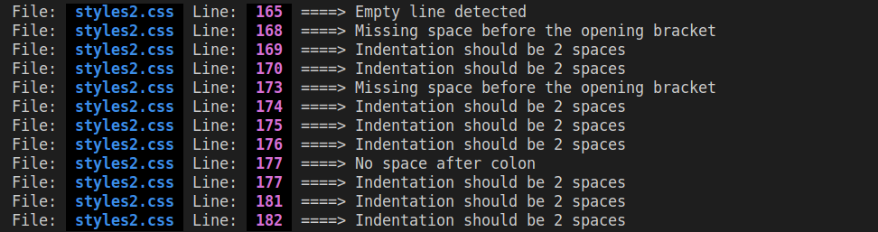
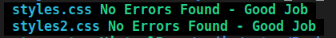
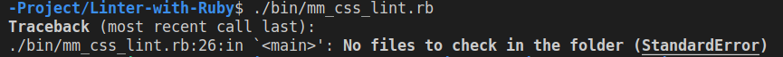
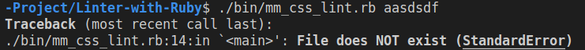
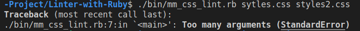

# CSS Linter

> A basic linter for CSS files developed using ruby.

This project was developed as a capstone project for the Microverse Ruby Module. The objective is to create a linter using the ruby language and test it using Rspec.

## Built With

- Ruby,
- Rspec

## **Getting Started**

To get a local copy up and running follow these simple example steps.

### Prerequisites
To run the linter you need to install RUBY on your computer. For windows, you can go to [Ruby installer](https://rubyinstaller.org/), for MAC and LINUX you can go to [Ruby official site](https://www.ruby-lang.org/en/downloads/) for instructions on how to install it.

### Setup
To run it can be done by simply typing in the console ./bin/mm_css_lint.rb

## **Usage**

### Overall description
This linter was created to work with CSS files inside the project folder and look for specific styling errors and will help your code to be more readable. 

### Parameters
The linter will take either one parameter that should be the file name for a specific file you want to inspect or no parameters which means the linter will check all the .css files that are inside the project folder.

### Type of linters
There are several types of checks performed by this linter, these are represented as individual linters internally. The internal linters implemented for the project are:
- **Trailing white space**: Checks for any spaces that are at the end of the line.
- **Empty line**: Checks for any extra empty lines inside the blocks and between blocks.
- **Space for property and value**: Checks for space after the colon at the value assignment for a property.
- **Colors**: Checks for all the color declarations to be in lower case.
- **Semicolon**: Checks for any semicolon missing inside the blocks.
- **Comments**: Checks for a space after a comment starts and a space before a comment ends.
- **Block declaration space**: Checks for a space before the opening bracket of a block and checks for no spaces in the closing bracket.
- **Indentation**: Checks for a two-space indentation inside blocks.

### Auxiliary methods and logic
The lint class has logic built in that helps it work. It has a flag to detect whether a line is inside or outside a block, it also has a method that helps determine which type of line is it and has a counter for empty lines as well.

### Results
The results are presented to the user in the console with a line of text that indicates the files where the error was found along with the line number and the description of the error. The file name and the line number have a different color to help the user see better where the problem is.

If there are no error the linter will let the user know by giving a message as well.

The linter also generates a hidden file (.results.mm) to store the log of errors found. 

### How to run the linter
To run the linter the user has to be inside the project root folder and then in the console type the following command:
> ruby ./bin/mm_css_lint.rb {Filename}

The linter will let you know what is going on and it has several errors that it can give.

When there are no files to check in the project.

When the file specified doesn't exists.

And finally when too many arguments are passed

## **Author**

👤 **Mateo Mojica**
- Github: [@mateomh](https://github.com/mateomh)
- Twitter: [@mateo_m_h](https://twitter.com/mateo_m_h)
- Linkedin: [Mateo Mojica](https://linkedin.com/mateo_mojica_hernandez)

## 🤝 Contributing

Contributions, issues and feature requests are welcome!

Feel free to check the [issues page](issues/).

## Show your support

Give a ⭐️ if you like this project!

## Acknowledgments

- Hat tip to anyone whose code was used
- Inspiration
- etc

## 📝 License

This project is [MIT](https://opensource.org/licenses/MIT) licensed.
